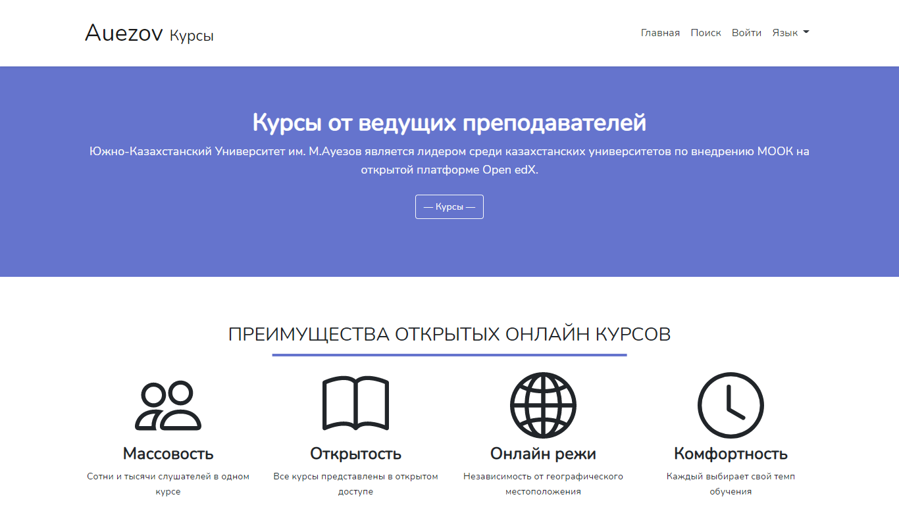

### Привет, Я **[Abdrashov Zamanbek](https://abdrashov.github.io)**, и добро пожаловать в мою портфолио на GitHub. 👋

### О себе
- 🌼 Я junior веб-разработчик из Казахстана
- 🏃 Cтудент технического университета
- 🌱 В настоящее время я изучаю Laravel и ООП
- 📫 Как со мной связаться: [Абдрашов Заманбек](https://abdrashov.github.io)
- ✨ Желаю себе удачи и чтобы мои мечты сбылись

### Проекты
- 💻 Проект [Auezov University Course](http://courses.shymhub.ru/)
- 📜 Лендинг [Lady Moon](https://lady-moon.github.io/)
- 🐙 Pet Project [Text Copy](https://textcopy.shymhub.ru/)

	

 

	
	

<!-- - 🌱 I’m currently learning API and OOP
- 💬 Ask me about anything [here](https://github.com/abdrashov/abdrashov/issues)
- 📫 How to reach me: [Abdrashov Zamanbek](https://abdrashov.github.io)
- ☘ I like silence
- ☕️ I drink tea -->

<!--
	- ✨
	- 🔭 I’m currently working on ...
	- 🌱 I’m currently learning ...
	- 👯 I’m looking to collaborate on ...
	- 🤔 I’m looking for help with ...
	- 💬 Ask me about ...
	- 📫 How to reach me: ...
	- 😄 Pronouns: ...
	- ⚡ Fun fact: ...
-->
